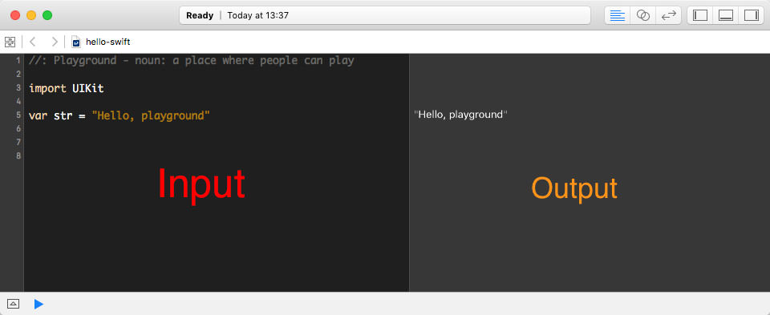

> Le **Swift** est un langage de programmation présenté en **2014** par
**Apple**. Il a été créé pour simplifier le développement d'applications pour
les environnements d'Apple (iOS, OS X, tvOS, watchOS), car les nouveaux
développeurs,  non habitués à `Objective C`, trouvent souvent celui-ci  trop dur
à appréhender. En 2015, Apple présente **Swift 2.0**, une version finalisée et
stable du langage. **Swift** est **open-source** depuis novembre 2015.

## Le playground

Avec Swift, Apple a introduit un nouveau moyen de s'amuser avec du code : le
**playground**. C'est à mi-chemin entre le script `python` et le `main de C`.
Vous pouvez y écrire des `fonctions`, y définir des `classes`, mais aussi y
exécuter du code en direct. Tout ceci est vraiment pratique pour **tester des
algorithmes**, des animations ou plus simplement **apprendre à maitriser le
langage**. Les `playgrounds` servent à prototyper plus qu’à écrire de vrais
outils.

Grâce à un partenariat entre Apple et IBM,  vous pouvez faire du **Swift sur
votre navigateur** avec Bluemix. La plate-forme de cloud coding d'IBM
[swiftlang.ng.bluemix.net](swiftlang.ng.bluemix.net) offre ainsi un
**`playground` en ligne** pour apprendre et vous entrainer en **Swift**. Donc
plus de limitation due à l'OS pour apprendre !

Sur OS X vous pouvez utiliser les `playground` avec Xcode, l'IDE d'Apple. Pour
créer un  **`playground`**,  vous ouvrez Xcode et `File→New→Playground`(ou
<kbd>⌥</kbd> + <kbd>⇧</kbd> + <kbd>⌘</kbd> + <kbd>N</kbd>). Vous nommez votre
`playground` et choisissez une plate-forme pour utiliser des frameworks
spécifiques pour chaque environnement (iOS ou OS X).



Enfin, Swift peut être utilisé comme langage de script, en créant un fichier
`.swift`, à exécuter dans le terminal avec `swift [file].swift`. Cette méthode
offre peu de confort, car même en ouvrant le fichier sur Xcode vous n'aurez pas
l'autocomplétion. Mais si vous êtes un mordu de **Linux**, sachez qu'il existe
un compilateur Swift Linux fourni par Apple sur la [page dédiée sur
swift.org](https://swift.org/download/#linux).

## Les variables

Les variables peuvent être constantes ou non. Le précompilateur d'Xcode est
assez strict avec la notion de constante. Si vous déclarez une variable non
constante mais que vous ne la modifiez nulle part, il vous proposera toujours de
la passer en constante.

```swift
// Exemple de variables/constantes
var aVariable:Type = something // variable (mutable)
let aConstant:Type = somethingElse // constante
```

Swift est un langage typé, mais le type peut être implicite lors de la
déclaration. Swift typera alors la variable automatiquement.

```swift
let explicitString:String = "Mario"
let implicitString = "Luigi" // This is a string too
```

Par défaut, les variables ne peuvent pas être nulles. Pour qu'une variable soit
dite *optionelle*, il faut déclarer une variable explicite en ajoutant un `?` à
son type.

```swift

// Ce code ne compile pas :
var implicitString = "Luigi"
name = nil // Error : Nil cannot be assigned to type 'String'

// Mais celui-ci, si
let explicitOptionalString:String? = "Mario"
explicitOptionalString = nil // Olé 💃
```

## Affichage

La fonction `print()` sert à afficher une chaîne de caractères dans la console
pour un script ou une application. Pour afficher des variables dans des chaînes
de caractères, on utilise cette syntaxe `\(maVariable)`. Exemple :

```swift
let age:Int = 32
let name:String = "Luigi"
let point:Float = 43.4

print("\(name) have \(age) and \(point) points")

// Ou
let toPrint:String = "\(name) have \(age) and \(point) points"
print(toPrint)
```

## Conditions & boucles

Un langage sans condition ça sert pas à grand-chose, donc voici la syntaxe :

```swift
if (a > x) || (a < y) { // Si a est plus grand que x ou plus petit que y
    print("a > x OR a < y ") // j'affiche
} else if a < z { // Sinon si ...
    print("a < z")
} else { // Sinon
    print("y <= a <= x")
}
```

Quelques exemples de boucles `while` et `for` :

```swift

// While
var i = 0
while i < 10 { // Tant que i < 10 j'affiche
    print("i = \(i)")
    i++ // incrémente i
}

// For classique
for var i = 0; i < 3; i++ {
    print("\(i)")
}

// For avec Range
for i in 0..<3{
    print(i)
}

// For-In
for element in myCollection {
    element.doSomething()
}
```

## Fonctions

Un script sans fonction c'est comme une raclette sans Saint-Nectaire. Beaucoup
de débutants le font mais une fois qu'on y a gouté, il est impossible s'en
passer !

Donc voici la syntaxe ~~d'un Saint-Nectaire~~... d'une fonction :

```swift
func myFunctionName(myStringInput:String,myIntInput:Int)->Int{

    // Votre code
    return 42 // Retour
}
```

En réalité, les fonctions sont un cas particulier d'utilisation d'une notion
introduite par Swift qu'ils appellent les *closures*. Pour les amateurs de
*Block* (Objective C, C++14) et  **Lambdas** (C++, Java,...), les closures
seront détaillées dans un prochain article.

## Le mot de la fin

Avec tout ça vous devriez déjà vous amuser un peu !
Pour information, les scripts Swift peuvent **utiliser [Foundation](https://developer.apple.com/library/mac/documentation/Cocoa/Reference/Foundation/ObjC_classic/)**
sur Linux ou OS X , le framework de base des OS d'Apple bien connu des
développeurs OS X/iOS. Il permet le traitement des fichiers, des `String` et
[bien plus](https://developer.apple.com/library/mac/documentation/Cocoa/Reference/Foundation/ObjC_classic/).
