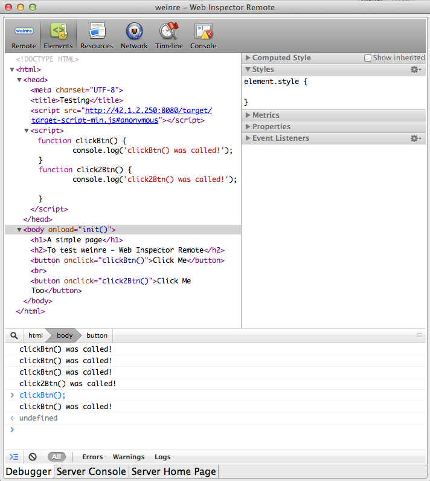
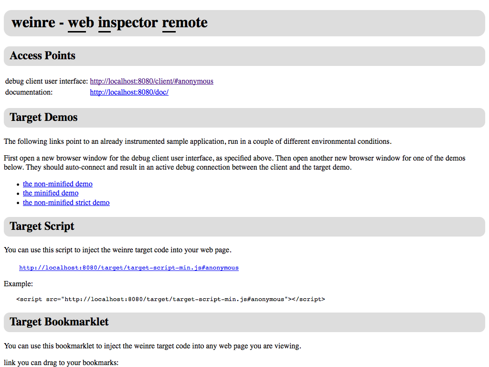
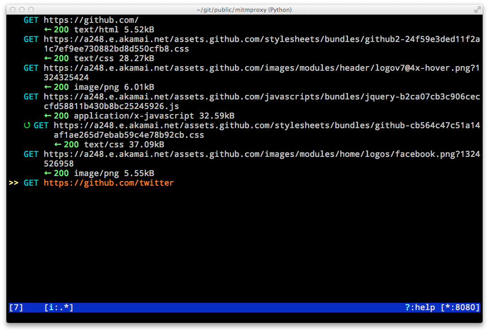

Vous souhaitez déboguer votre site ou application web mais vous ne savez pas trop comment faire ? Bon. Je sais que vous savez mais je peux peut-être vous faciliter la tâche.

Commençons par le plus simple.

## Un navigateur, un inspecteur

Si vous ne voulez pas vous prendre la tête, la solution la plus simple reste d'utiliser l'inspecteur fourni par votre navigateur pour analyser vos pages web. Fini les add-ons à installer (comme Firebug), chaque navigateur récent a maintenant son propre inspecteur, même Internet Explorer.

Ça, c'est la partie que vous devez sûrement déjà savoir. Par contre, quid du mobile ?

### Oui, quid du mobile ?

C'est justement principalement ce qui m'intéresse ici.

Pour ce qui est du mobile, je vous propose de commencer par brancher votre téléphone ou tablette sur votre poste en USB puis de lancer deux navigateurs. Mais pas n'importe lesquels. Les mêmes navigateurs sur desktop et sur mobile. Par exemple, si vous voulez déboguer Safari sur iOS, alors lancez Safari sur votre Mac. Si vous voulez déboguer Chrome sur Android, alors lancez Chrome sur votre desktop. Ce n'est vraiment plus aussi compliqué qu'auparavant où il était nécessaire d'installer des applications en ligne de commande (comme [adb](https://developer.android.com/tools/help/adb.html) par exemple) avant de pouvoir rendre la connexion possible. Maintenant, les navigateurs incorporent directement de quoi se connecter aux mobiles.

Une connexion se fera entre les deux navigateurs (mobile et desktop) et vous permettra de voir ce qu'il se passe sur votre mobile en regardant la fenêtre de devtools sur votre desktop. Quelques précisions pour chacun des navigateurs :

- Chrome : lancez l'URL `chrome://inspect`
- Safari : allez dans `develop` puis vous verrez vos appareils connectés et les URL lancées sur vos appareils

Pas mal non ?

Mais nous pouvons aller encore plus loin grâce à Firefox qui va nous faciliter la tâche. En effet, celui-ci est capable de déboguer n'importe quel navigateur via WebIDE et son _adapter_ [Valence](https://developer.mozilla.org/en-US/docs/Tools/Valence).

## Allez, Firefox WebIDE !

Au départ ce projet avait pour but de déboguer Firefox OS mais grâce au projet [Valence](https://developer.mozilla.org/en-US/docs/Tools/Valence), WebIDE permet maintenant aussi de se connecter à d'autres navigateurs comme iOS Safari ou Desktop Chrome (n'importe en fait) et de pouvoir déboguer dans les devtools de Firefox. Ça, c'est cool.

Pour activer WebIDE sur votre Firefox, ouvrez un onglet et rentrez comme URL<br />`about:config?filter=devtools.webide.enabled`<br />
puis mettre l'option à `true`.

Allez après dans devtools, "settings" (l'engrenage) et activez :

- `Enable browser chrome and add-on debugging toolboxes`
- `Enable remote debugging`

puis redémarrez.

Vous devriez avoir "WebIDE" de disponible mais aussi "Browser Toolbox" qui est un debugger pour inspecter l'application Firefox en elle-même. Pratique pour faire des thèmes !

Une fois WebIDE lancé, allez dans `Select runtime` puis `Install Simulator` et installez `ADB Helper Add-on` ainsi que `Tools Adapters Add-on`.

Vous êtes bon(ne) pour pouvoir déboguer. Plus qu'à brancher votre appareil, allez dans `Select runtime` et le voir dans la section `USB Devices`.

N'hésitez pas à vous référer à la [documentation officielle](https://developer.mozilla.org/en-US/docs/Tools/WebIDE) pour de plus amples informations.

Un petit hic tout de même. Cela reste une beta (à mon sens), de ce fait la connexion est un peu instable. Il est parfois difficile de se connecter à un appareil. Pour cela, débranchez votre téléphone puis rebranchez-le, et redémarrez Firefox puis relancez WebIDE, cela devrait être bon.

Mis à part ceci, c'est top.

> Oui mais moi je dois déboguer Android Browser, ça marche tout ça ?

Biiiien, non. J'avoue tout. Aucune des solutions que je viens de vous donner ne fonctionne sur Android Browser.

> Euh… Quoi ?!

Oui oui, je comprends que vous soyez étonné(e). Moi aussi, je suis dépité à chaque fois que je dois développer dessus. Ce navigateur est une belle merde. Il ne se met à jour que quand votre OS s'y met. Il est le navigateur par défaut et le moteur des webviews sur de nombreux (anciens (!|?)) Android. À vrai dire, je ne comprends même pas comment ce navigateur a pu exister sauf pour dire "Hey, vous avez vu, on ne vous a pas imposé Chrome, contrairement à Microsoft avec IE". Ils auraient p'tête dû finalement.

Bref. Rassurez-vous, j'ai des solutions.

Je pourrais vous parler du format en **CLI** mais je ne pense pas que cela vous intéresserait. Et vu qu'on ne peut pas inspecter le DOM, juste voir la console, ce n'est vraiment pas plaisant pour déboguer.

Je pourrais aussi vous parler de la solution du `about:debug` mais c'est chiant (mais ça dépanne). Cela permet d'afficher une console JS dans le navigateur du mobile. Je vais plutôt vous parler ici d'un inspecteur écrit en page web qui se branche partout, un peu comme un Firebug lite. Son petit nom ? [weinre](http://people.apache.org/~pmuellr/weinre-docs/latest/).

## weinre

… est une solution plus trop récente mais qui a le mérite de fonctionner partout, facilement et surtout sur Android browser. Celui-ci va créer une page web avec un webkit-debugger-like, qui lui est connecté via un websocket sur le site que vous êtes en train de déboguer, vous permettant à la fois d'avoir une console mais aussi une inspection du DOM. Et ça, c'est vraiment chouette.



Passons à son installation.

### Installation

```console
$ (sudo) npm -g install weinre
```

### Utilisation

Lancez d'abord le process :

```console
$ weinre
```

Ajoutez le script dans votre page qui communiquera avec votre serveur (exemple) :

```javascript
<script src="http://localhost:8080/target/target-script-min.js#anonymous"></script>
```

Puis ouvrez la page `http://localhost:8080`, vous devriez avoir quelque chose comme ceci :



Plus qu'à cliquer sur `http://localhost:8080/client/#anonymous` et vous arriverez sur l'interface du debugger.

Attention par contre. Ayant eu des problématiques de temps de connexion au websocket, j'ai dû rajouter un `setTimeout` avant de lancer mon JavaScript afin que la connexion entre la page web et le serveur se fasse pour bien afficher la totalité des `console.log` et autres. Sans ça, j'ai vu le début de mon app ne pas être inspectée, dommage.

Pour le moment j'ai réglé ce problème en mettant un `setTimout` de 2000ms sur l'exécution de mon code car il n'y a actuellement pas de moyens de savoir si la connexion au websocket s'est faite ou non.

Sachez cependant que le projet n'est plus trop maintenu mais que le principal _maintainer_ est encore à l'écoute et recevra volontiers vos améliorations.

Il existe deux alternatives à weinre :

- [jsconsole](http://jsconsole.com/remote-debugging.html) (que je n'ai pas testé)
- [Vorlon.js](http://vorlonjs.com/) : très sympa, très prometteur, plus propre que weinre. Seul hic, j'ai voulu tester Vorlon.js sur Android Browser (Android 4.3), il a fait planter Android Browser rendant impossible le debug. Dommage, j'aurais bien remplacé weinre par celui-ci.

---

Bien. On a fait le tour des solutions pour inspecter facilement le DOM ainsi qu'avoir une console sur n'importe quel navigateur.

Ce qui serait intéressant maintenant, c'est d'analyser les trames HTTP de n'importe quel appareil.

## Comment analyser le flux HTTP

Pour cette tâche, je vous propose d'installer l'outil [mitmproxy](http://mitmproxy.org/) qui vous permettra de créer un proxy récupérant tout votre trafic HTTP et de vous l'afficher requête par requête.

Ce qui va sûrement vous intéresser sera la partie [transparent proxying](http://mitmproxy.org/doc/transparent.html). Le proxy se chargera juste d'écouter votre trafic et de l'afficher.

Il sera nécessaire aussi de configurer votre navigateur afin que celui-ci se connecte à votre proxy.

Si vous êtes sur Android, il vous est nécessaire de le spécifier dans la configuration réseau de votre appareil. Pour cela :

- Connectez-vous au WiFi (du même réseau que votre hôte) (par exemple "MoOx")
- Allez dans "Settings", "Wi-Fi"
- Restez appuyé sur le nom du WiFi (toujours "MoOx")
- Une popin apparaîtra, cliquez sur "Modify network"
- Cochez "Show advanced options"
- "Proxy settings", mettez `manual`
- Entrez les informations de mitmproxy pour vous y connecter
- Validez

Tout passera maintenant par lui et vous aurez dans votre shell une belle interface montrant toutes les trames passant.



## Note

Une petite note rapide. Pour utliser le Simulator iOS (si vous n'avez pas d'iPhone/iPad sous la main par exemple) il est possible que vous deviez installer [iOS Webkit Debug Proxy](https://github.com/google/ios-webkit-debug-proxy). Je n'ai pas eu à le faire mais [@tfeserver](https://twitter.com/tfeserver) en a eu besoin. Je vous laisse ça de côté si par hasard cela vous était nécessaire.

---

Avec ça, vous pouvez maintenant masteriser le debug sur tous les appareils sans vous prendre la tête. Il existe aussi une solution s'appelant [BrowserSync](http://www.browsersync.io/) permettant à la fois le debug et la synchro des comportements sur les différents devices mais ça, ce sera peut-être pour un prochain post.

Bon débug.


